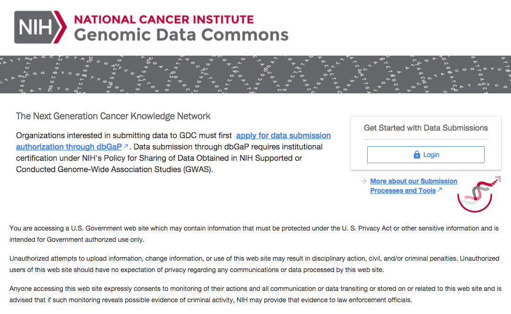
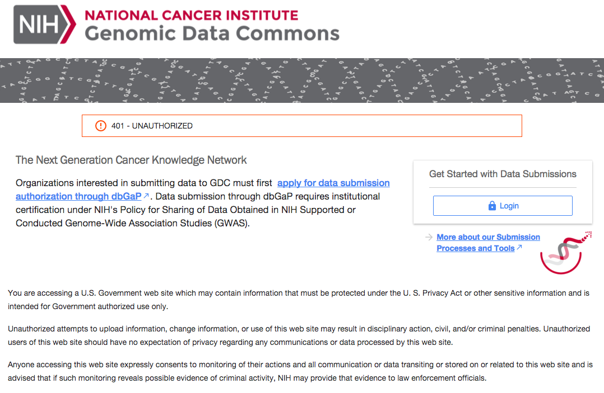
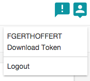
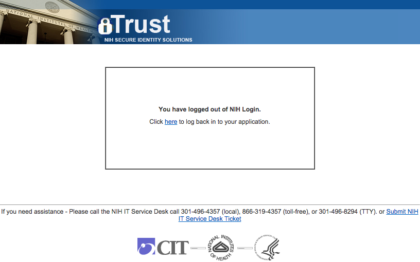

# Overview

Accessing the GDC Data Submission Portal requires eRA Commons credentials with appropriate dbGap authorization. See [Obtaining Access to Submit Data]( https://gdc.nci.nih.gov/submit-data/obtaining-access-submit-data) for more details.

The [Authentication](../gdc/authentication-authorization999999999999999999999999999999999999999999999999999999999999999999999999999999999999999999999999999999999999999999999999999999999999999999999999999999999999999999999999999999999999999999999999999999.md#authentication) section of the documentation provides more details about the process itself.

# Authorization

Permissions are attached to each user account. Access can be granted to one or more projects. Those permissions will apply throughout the GDC Data Submission Portal and will define how data is being displayed.

Based on the number of projects granted to the user, the GDC Data Submission Portal will adjust its layout and provides different functionalities.

# GDC Data Submission Portal Authentication

When accessing the GDC Data Submission Portal for the first time, users will be presented with splash page providing more details about the system and a login button.

Links to GDC Website are also available to provide the user with more details about dbGaP as well as more details about the submission process and tools.

By Clicking on "Login", a pop-up will open and users will be invited to authenticate through eRA Commons. If successful, the user will be redirected to the GDC Data Submission Portal Dashboard.

The login page will show up again if users logout or upon expiration of their authentication token after 30 minutes of inactivity.

## Failed authentication

If the user fails to authenticate through eRA Commons and close the authentication pop-up, a "401 - UNAUTHORIZED" message will show up on the splash screen.

# Obtaining a Token

A Token is required to upload data to GDC, as well as to download controlled-access files, using the GDC Data Transfer Tool or the GDC Application Programming Interface.

The GDC Data Transfer Tool is optimized for large transfers with multi-part upload and integrity checking, making it the most efficient tool for molecular data submission.

Tokens are strings of characters provided with every GDC call requiring authentication. A file containing a token can be obtained through GDC Data Submission Portal once your NIH eRA Commons account has been established. Your GDC account will be automatically established upon first login and you will see a drop down menu next to your user name.

Users can download and save their token from here.

# Logout

Users can log-out from GDC Data Submission Portal by clicking on their profile icon on the top right corner (See screenshot above).

Logging out happens on eRA Commons website.
